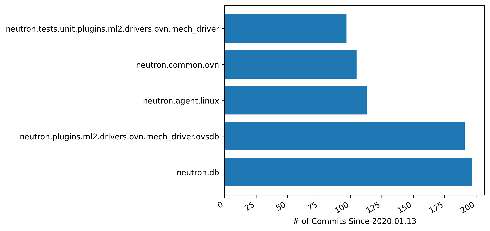

# Report

In this report, we present the method we use to identify the most actively maintained modules in the OpenStack Neutron project in the past three years, and the top 5 most active modules we obtained from data.

## Method

We consider modules as the aggregate of the Python files that appear within the subdirectories of the `neutron/` folder of the repository. In other words, a module is a subdirectory of `neutron/` in which there is at least one `.py` file. To align with Python conventions, we use `.` instead of `/`  for nested modules, e.g., `neutron.db`.

We measure module activity using the number of non-merge commits that modified at least one `.py` file under this module. We exclude merge commits as most of their modifications are duplicates of previous, non-merge commits.

## Result

In total, 326 modules are changed in the time period between 2020.01.13 and 2023.01.13. Among them, the most active ones are `neutron.db` (197 commits), `neutron.plugins.ml2.drivers.ovn.mech_driver.ovsdb` (191 commits), `neutron.agent.linux` (113 commits), `neutron.common.ovn` (105 commits), and `neutron.tests.unit.plugins.ml2.drivers.ovn.mech_driver` (97 commits), as shown in the Figure below. It seems that most of the development activities are related to modules related to database, Linux, and a specific driver. Further in-depth analysis of other data sources (e.g., issue trackers and project roadmaps) is needed to explain why these modules have the most activity in the past three years.

